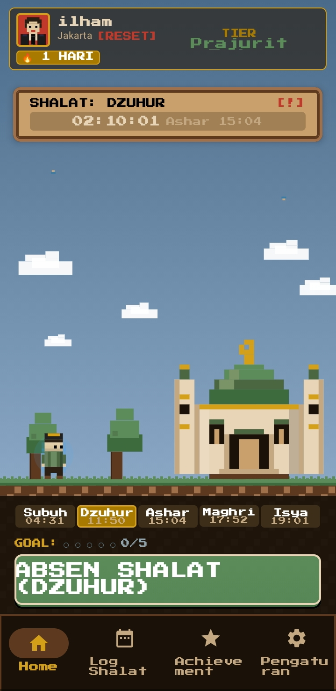
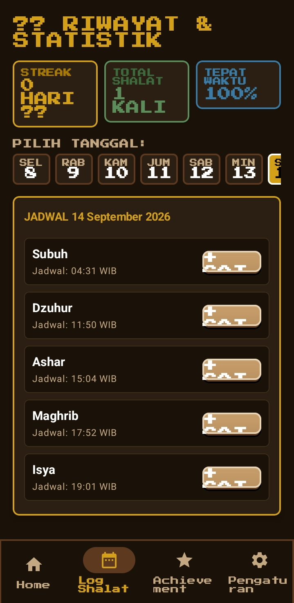
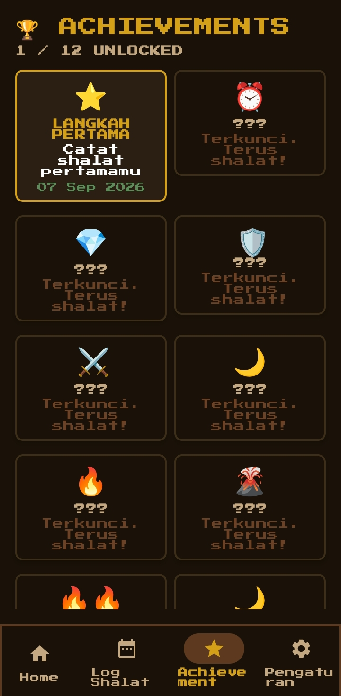
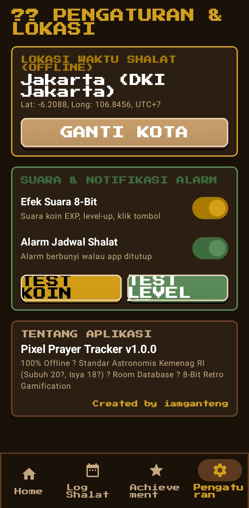

# 🕌 Yuk Sholat — Pixel Art Prayer Tracker


Aplikasi Android pelacak shalat 5 waktu bergaya **pixel-art RPG 8-bit**. Gamifikasi ibadah: absen shalat dapat poin, raih streak, buka achievement, dan naik tier sambil dimanjakan animasi level-up ala Dragon Ball.

> 💾 **Download APK:** https://github.com/fatihahilham23-design/yuksholat/releases/latest

> 📲 **Cara install di HP:** buka link APK → tap **yuksholat.apk** → jika muncul *"Install blocked"* → **Settings → Allow from this source** (Chrome) → **Install**.

> 100% offline. Perhitungan waktu shalat menggunakan rumus astronomi, tanpa koneksi internet.

---

## 📸 Screenshot

| Home | Log Shalat | Achievement | Pengaturan |
|---|---|---|---|
|  |  |  |  |

---

## ✨ Fitur Unggulan

- **Tracker 5 Waktu Shalat** — Absen setiap shalat, dapat poin (+100 tepat waktu / +30 qadha)
- **Daily Streak** — Konsisten 1 shalat/hari, streak bertahan. Ada 1 streak-freeze gratis
- **Daily Goal 5/5** — Lengkapi semua shalat, bonus 50 XP
- **12 Achievement Badge** — Langkah pertama hingga penakluk fajar
- **Tier System RPG** (5 tingkatan): Pemula Shalat → Prajurit Fajar → Ksatria Masjid → Master Istiqomah → Legenda Iman
- **Animasi Transformasi Level-Up** — Efek power-up ala Goku, full-screen 2.5 detik
- **Ramadan Mode** — Deteksi Ramadan offline (2025–2030), banner special, alarm imsak & sahur
- **Home Screen Widget** — Countdown shalat & status 5 waktu langsung di home screen (Glance)
- **Alarm Shalat** — Notifikasi + reschedule otomatis setelah boot
- **Pixel Art Animated** — Langit dinamis sesuai waktu shalat, awan bergerak, burung terbang, karakter jalan ke masjid
- **Splash Screen** — Karakter melambai + quotes motivasi shalat random
- **Offline Prayer Calculator** — Hitung waktu shalat akurat berdasarkan koordinat & tanggal (astronomi Kemenag: Subuh 20°, Isya 18°)

---

## 🛠️ Tech Stack

| Layer | Teknologi |
|---|---|
| Bahasa | Kotlin 2.0 |
| UI | Jetpack Compose (Material 3) |
| Arsitektur | MVVM (ViewModel + StateFlow) |
| Database | Room + KSP (acara, profile, tier, achievement) |
| Navigasi | Navigation Compose |
| Alarm | AlarmManager + BroadcastReceiver |
| Widget | Glance AppWidget (Jetpack Compose) |
| Audio | AudioTrack (chiptune 8-bit sintesis, tanpa file) |
| Font | Press Start 2P (bundled, offline) |
| Min SDK / Target | API 26 / 34 |

---

## 📁 Struktur Proyek

```
app/src/main/java/com/yuksholat/
├── alarm/          # Scheduler & receiver alarm shalat/imsak/sahur
├── audio/          # RetroSoundSynthesizer (efek suara 8-bit)
├── data/
│   ├── calculation/   # OfflinePrayerCalculator (rumus astronomi)
│   ├── local/         # Room DB, entity, DAO
│   ├── model/         # PrayerType, CityPreset, PrayerTimesResult
│   ├── repository/    # PrayerRepository (poin, streak, achievement)
│   └── util/          # RamadanDetector
├── ui/
│   ├── components/    # Komponen pixel-art (masjid, karakter, pohon, burung…)
│   ├── navigation/    # Bottom nav 4 tab
│   ├── screens/       # home, history, achievements, settings, splash
│   ├── theme/         # Palette earth-tone, font pixel, MaterialTheme
│   └── widget/        # Glance home screen widget
└── MainActivity.kt    # Splash + exit confirmation
```

---

## 🚀 Cara Build

**Prasyarat:** Android Studio (Jellyfish+) atau JDK 17+, Android SDK 34.

```bash
# Linux/Mac
./gradlew assembleDebug

# Windows
gradlew.bat assembleDebug
```

Atau buka folder ini di **Android Studio** → Run ▶.

APK hasil build: `app/build/outputs/apk/debug/app-debug.apk`

Install ke perangkat:
```bash
adb install -r app/build/outputs/apk/debug/app-debug.apk
```

---

## 🎮 Alur Gamifikasi

1. Buka aplikasi → **Splash screen** 3 detik (karakter melambai + quotes)
2. Atur nama → **Misi pertama**: absen shalat sekarang
3. Tekan **ABSEN SHALAT** → karakter berjalan ke masjid, masuk & "shalat"
4. Dapat **+100 EXP** (poin) → level naik per 300-3000 poin
5. Naik tier T2+ → **animasi transformasi** charge → flash → reveal
6. Rajin absen → **streak 🔥**, buka **achievement**, target **goal 5/5**
7. Ramadan → **mode khusus** dengan alarm imsak/sahur

---

## 📜 Lisensi

Proyek ini dibuat untuk keperluan **portofolio**. Font Press Start 2P dilisensikan di bawah [SIL Open Font License](https://openfontlicense.org).

---

**Dibuat dengan ❤ dan pixel demi istiqomah.**